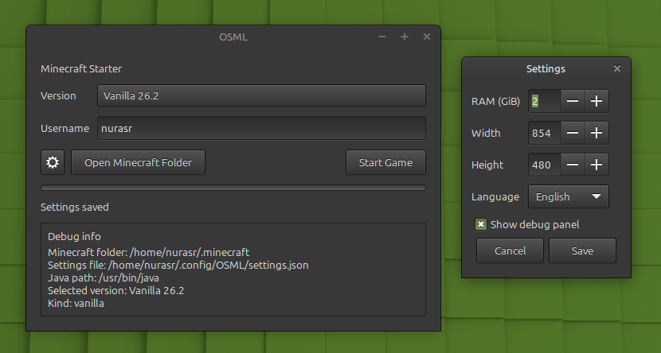
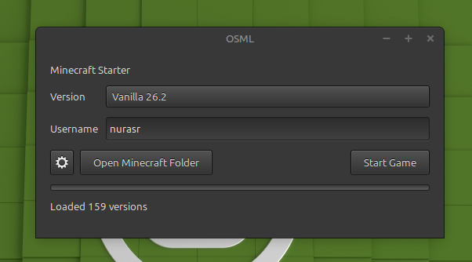

# OSML Launcher

**OSML (Open Source Minecraft Launcher)** is a free and open-source Minecraft launcher written in **Python** with **PyGObject** for a native desktop experience on Linux and other platforms supported by GTK.

OSML aims to provide a lightweight, modern, and fully open launcher capable of managing and launching multiple Minecraft versions and modding platforms.

---

## Features

* Modern desktop interface built with **PyGObject**
* Written entirely in **Python 3.10**
* Support for:

  * Vanilla Minecraft
  * Forge
  * NeoForge
  * Fabric
* Version selection interface
* Profile and username management
* Launch log and status output
* Open Minecraft directory directly from the launcher
* Open-source

---

## Supported Versionsc

OSML supports a wide range of Minecraft releases, including:

* Vanilla versions
* Forge versions
* NeoForge versions
* Fabric versions

---

## Authentication

OSML is a pirate Minecraft launcher so you don't need microsoft account.

---

## Screenshots

Screenshots here:




### Requirements (LAUNCHER, NOT MINECRAFT)

Python version: 3.10 or higher

Java version: 21 or higher 

CPU: x64

GPU: potato

RAM: 2 Gib

## Running

At first install libraries

```pip install minecraft-launcher-lib==8.0 PyGObject==3.56.3 requests==2.34.0```

then if you use windows run ```launcher.bat``` and if you use linux run ```launcher.sh``` 

> [!WARNING]
> you need to make .sh executable ```chmod +x launcher.sh```.

## Contributing

Contributions, bug reports, feature requests, and pull requests are welcome.

If you would like to help improve OSML, feel free to open an issue or submit a pull request.

## License

This project is licensed under the MIT License.

See the `LICENSE` file for details.
